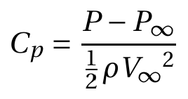
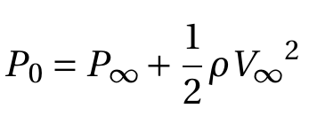
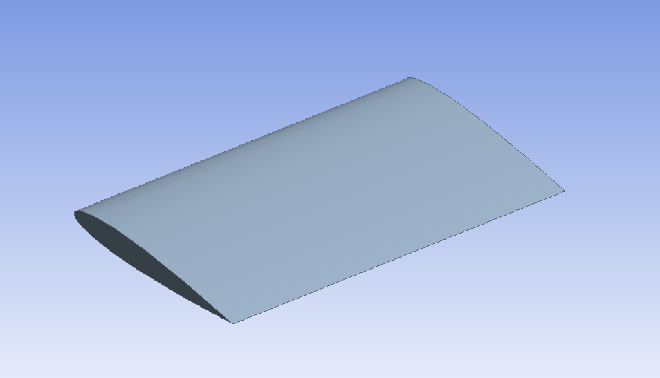

# Theory:

Airfoils play a crucial role in various applications within aeronautical engineering, particularly in aircraft. The lift force, essential for sustaining flight, is generated through the forward motion of the aircraft. When in the airflow, the shape of the airfoil induces a downward force on the airflow, creating a pressure disparity. Specifically, the upper surface of the airfoil experiences lower pressure, while the lower surface encounters higher pressure. This pressure difference results in a net aerodynamic force acting on the airfoil.

For this force to manifest, at least one of the following two conditions must be met: 1) The airfoil must possess a camber along its chord, and 2) The airfoil should be inclined to the direction of the airflow. The resultant aerodynamic force can be decomposed into two components: the Lift force, perpendicular to the freestream direction, and the Drag force, parallel to the flow direction. Figure 1 provides a visual representation of various terminologies associated with the airfoil.

 

### Camber
The camber of an airfoil is the characteristic curve of its upper or lower surface

### Mean camber line
The mean camber line is an imaginary line that is halfway between the upper and lower surfaces of an airfoil. It intersects the chord line at the leading and trailing edges. 

### Chord line
A chord line is defined as the straight line connecting the leading and trailing edges.

### The angle of attack (AOA)
The angle formed between a reference line on a body and the oncoming flow.

In the present experiment, we characterize the lift produced by the NACA 0015 at different angles of attack, by measuring pressure at different points on the upper and lower surface of the airfoil.

1. By definition of Coefficient of pressure,

 &nbsp;&nbsp;&nbsp;&nbsp;&nbsp;&nbsp;&nbsp;&nbsp;&nbsp; (1)

From Bernoulli's Equation,

 &nbsp;&nbsp;&nbsp;&nbsp;&nbsp;&nbsp;&nbsp;&nbsp;&nbsp; (2)

and from Eq. (1) and Eq. (2)

 &nbsp;&nbsp;&nbsp;&nbsp;&nbsp;&nbsp;&nbsp;&nbsp;&nbsp; (3)

2. Section Lift coefficient for airfoil is given by

 &nbsp;&nbsp;&nbsp;&nbsp;&nbsp;&nbsp;&nbsp;&nbsp;&nbsp; (4)

here,

P – Pressure

Cp – Coefficient of pressure

V – Velocity

ρ – Density of the fluid

#### Subscript

x – measurement port

0 – Total, measured at the settling chamber.

∞ – Free-stream, measured the inlet section.

l – lower surface

u– upper surface

 

## Apparatus
- Airfoil model NACA 0015
-Wind tunnel
-Electronic pressure measurement instrument
-Data acquisition system

## Airfoil model

An airfoil model of NACA 0015 shape with a chord length of 20 cm is used as the model for this experiment. The airfoil model consists of pressure ports. It is placed in the test section and the mounting mechanism allows to attain any required angle of attack. The pressure ports are connected to the pressure transducer using pneumatic tubings.
 
## Wind Tunnel

An open return low subsonic suction-type atmospheric wind tunnel generates the flow a 1-D uniform steady flow in the test section, where the model is placed/mounted. Wind tunnel components are a honeycomb section, a settling chamber, a contraction cone, a test section, a diffuser, a suction fan, and a motor. The air from the atmosphere enters the tunnel through the honeycomb section. Honeycomb reduces the turbulence from the atmosphere by breaking down the disturbances and stretching the flow due to its structure. The flow then goes through the settling chamber, which has two wire meshes, further reducing incoming turbulence. The settling chamber has a large volume which further dissipates any disturbances. The contraction cone increases the velocity by reducing area at the expense of pressure. There are two pressure tapings in the wind tunnel; one at the settling chamber, which gives stagnation or total pressure, and the second at the end of the contraction cone, which gives static pressure. The difference in these two pressure is used to calculate the inlet velocity of the test section. The test section is a constant cross-section area where we achieve a one-dimensional, steady, and uniform flow. Models are mounted in this part for the test. Diffuser has two functions: one, it reduces the velocity and increases the pressure leading to the suction fan, which results in less work required by the fan; and two, it provides a gradual decrease in velocity or increase in pressure after the test section, which prevents any flow separation and backflow. The suction fan creates the necessary pressure difference required to maintain the airflow. The fan is run by the motor, which can run at different rpm to create a range of velocity. The rpm of the motor is controlled by a variable frequency drive (VFD). 

## Electronic pressure measurement instrument

 

An electronic pressure measurement instrument is used to measure pressure coming from the cylinder model. Here we have used a Scanivalve-made digital sensor array (DSA 3217); it has 16 temperature-compensated piezoresistive sensors with a pneumatic calibration valve, RAM, 16-bit A/D converter, and a microprocessor in a compact, self-contained module. It outputs pressure values in the user-defined engineering unit directly. We can measure 16 pressures simultaneously using this device. It uses an Ethernet connection for communication with any computer.

## Data acquisition system
To operate DSA, a manufacturer-provided software DSALink is required. The software is run using a computer, where a user defines the necessary parameters like data rate, number of samples, and engineering unit. DSA is connected to a computer via Ethernet using TCP/IP protocol.

 
